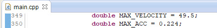

## Self-Driving Car Engineer Nanodegree Program
## Term 3 Project 1
### Path Planning Project

---

### Writeup Template

In this project, your goal is to design a path planner that is able to create smooth, safe paths for the car to follow along a 3 lane highway with traffic. A successful path planner will be able to keep inside its lane, avoid hitting other cars, and pass slower moving traffic all by using localization, sensor fusion, and map data.

---
### Rubric Points
Here I will consider the [rubric points](https://review.udacity.com/#!/rubrics/1020/view) individually and describe how I addressed each point in my implementation. Here is a link to my [project code](https://github.com/mymachinelearnings/CarND-Path-Planning-Project/)

---
#### The code compiles correctly
The snippet below shows my code is compiled correctly


#### The car is able to drive at least 4.32 miles without incident
The snippet below shows the car drove over 8 miles without an incident


#### The car drives according to the speed limit
The car never exceeded 50 MPH as the max velocity is set as 49.5 MPH



#### Max Acceleration and Jerk are not Exceeded
Acceleration/deceleration was set to 0.224 m/s^2 which provides a smooth comfort experience during most of the cases.
For cases where the velocity is far lesser than MAX_VELOCITY and there's no car within the next 30 m, then the acceleration is set to 2*0.224 m/s^2. This is useful during the start of the car or when the car comes to a total halt and starts again.
When the car ahead within 30 m, the standard deceleration of 0.224m/s^2 occurs, but when the vehicle ahead is very near (<10 m), deceleration is set to 3*0.224 to apply harder break to avoid collission. This was done when the car ahead suddenly stops and the standard deceleration would not stop the vehicle before colliding the car in front

#### Car does not have collisions
The image above shows there are no incidents during the 8.5 mile drive

#### The car stays in its lane, except for the time between changing lanes
The car's lane is set using the frenet lateral co-ordinate (d) and since we know the width of the lane, the car was always set to the center of the lane

#### The car is able to change lanes
Yes, whenever there's a vehicle ahead is < 30 m and it is moving slower than the ego vehicle(the vehicle in question / our vehicle), then the ego vehicle takes the lane that's safer to it. The logic explained in Behaviour planning module below is used to achieve this behaviour


### Reflection
The following concepts are implemted for determining the final trajectory to the vehicle
* Prediction

    It is very important to predict the behaviour of other vehicles in order to determine the next steps of the ego vehicle. The prection module is implemented between the lines 265 & 320 in main.cpp
    In this module, using the sensor fusion data, a prediction is made on where the other vehicles are with respect to the ego vechicle. It considers the vehicles in all the three lanes.
    It is considered dangerous to be behind a car within 30 m, and when this happens, the car decelerates. This module checks for this scenario and sets a flag.
    Similarly, it also predicts the position of the car in the other lanes. If a car is over 30 m behind and 20 m ahead of the car in the other lane, only then it is considerd to be safe and do a safe lane change. This module checks for this scenario and sets a flag.
    Note : It is to be noted that the simulator is 1 cycle behind, so the prediction is done on the next step (which is 0.02 sec ahead). This is done using the following code snippet
    
    `other_car_s += ((double)prev_size * 0.02 * other_car_vel);`
    
* Behaviour Planning

    This module is responsible for the actual decision making during the course of the travel. The prection module is implemented between the lines 322 & 384 in main.cpp
    It checks when it is safe to change lanes when something is ahead of you in your current lane. The flags set by the prediction module are used to determine the decision
    
        If there's a car ahead
		check if LEFT LANE is free and change lane, else
		check if RIGHT LANE is free and change lane, else
		slow down

        Always be on middle lane when its free, or you are not overtaking.
        This gives space for other faster moving vehicles to overtake in the left most lane
        So, if the vehicle is not in MIDDLE LANE,
		check if vehicle is in LEFT LANE, and if middle lane is free, move to middle lane
                                            OR
		check if vehicle is in RIGHT LANE, and if middle lane is free, move to middle lane

* Trajectory Generation

    This forms the major chunk of implementation in main.cpp - Lines 386 to 551
    Trajectory generation not only involves a smooth trajectory for lane change or straight drive, but also a sequence of time steps in which this transition needs to be performed.
    Map waypoints given by the Map are very sparse and it is not realistic to use those points to determine the actual path. Hence using those sparse points, a trajectory is first generated and then it is interpolated for every time cycle of the simulator (which is 0.02 seconds)
    The generation of trajectory is done using a library called 'Spline'. A spline generates a line that connects all the points sent to it. In this case, we consider the car's current position, its previous point, and 3 additional points in the future that are very sparse (30 m apart) to generate a smooth spline. Once the spline is generated, we can interpolate it to get as many points as we could.
    In this case, we take the velocity and determine the points that are 0.02 seconds apart (which is simulator cycle frequency - 50 Hz) and get hte corresponding x & y co-ordinates. Once we have the next 50 points in the trajectory that are 0.02 sec apart, we can give them to the simulator via next_x_vals, next_y_vals varaibles which will be interpreted by simulator as guiding points and the car follows that path
   
### Simulator.
You can download the Term3 Simulator which contains the Path Planning Project from the [releases tab (https://github.com/udacity/self-driving-car-sim/releases/tag/T3_v1.2).

### Goals
In this project your goal is to safely navigate around a virtual highway with other traffic that is driving +-10 MPH of the 50 MPH speed limit. You will be provided the car's localization and sensor fusion data, there is also a sparse map list of waypoints around the highway. The car should try to go as close as possible to the 50 MPH speed limit, which means passing slower traffic when possible, note that other cars will try to change lanes too. The car should avoid hitting other cars at all cost as well as driving inside of the marked road lanes at all times, unless going from one lane to another. The car should be able to make one complete loop around the 6946m highway. Since the car is trying to go 50 MPH, it should take a little over 5 minutes to complete 1 loop. Also the car should not experience total acceleration over 10 m/s^2 and jerk that is greater than 10 m/s^3.

#### The map of the highway is in data/highway_map.txt
Each waypoint in the list contains  [x,y,s,dx,dy] values. x and y are the waypoint's map coordinate position, the s value is the distance along the road to get to that waypoint in meters, the dx and dy values define the unit normal vector pointing outward of the highway loop.

The highway's waypoints loop around so the frenet s value, distance along the road, goes from 0 to 6945.554.

## Basic Build Instructions

1. Clone this repo.
2. Make a build directory: `mkdir build && cd build`
3. Compile: `cmake .. && make`
4. Run it: `./path_planning`.

Here is the data provided from the Simulator to the C++ Program

#### Main car's localization Data (No Noise)

["x"] The car's x position in map coordinates

["y"] The car's y position in map coordinates

["s"] The car's s position in frenet coordinates

["d"] The car's d position in frenet coordinates

["yaw"] The car's yaw angle in the map

["speed"] The car's speed in MPH

#### Previous path data given to the Planner

//Note: Return the previous list but with processed points removed, can be a nice tool to show how far along
the path has processed since last time. 

["previous_path_x"] The previous list of x points previously given to the simulator

["previous_path_y"] The previous list of y points previously given to the simulator

#### Previous path's end s and d values 

["end_path_s"] The previous list's last point's frenet s value

["end_path_d"] The previous list's last point's frenet d value

#### Sensor Fusion Data, a list of all other car's attributes on the same side of the road. (No Noise)

["sensor_fusion"] A 2d vector of cars and then that car's [car's unique ID, car's x position in map coordinates, car's y position in map coordinates, car's x velocity in m/s, car's y velocity in m/s, car's s position in frenet coordinates, car's d position in frenet coordinates. 

## Details

1. The car uses a perfect controller and will visit every (x,y) point it recieves in the list every .02 seconds. The units for the (x,y) points are in meters and the spacing of the points determines the speed of the car. The vector going from a point to the next point in the list dictates the angle of the car. Acceleration both in the tangential and normal directions is measured along with the jerk, the rate of change of total Acceleration. The (x,y) point paths that the planner recieves should not have a total acceleration that goes over 10 m/s^2, also the jerk should not go over 50 m/s^3. (NOTE: As this is BETA, these requirements might change. Also currently jerk is over a .02 second interval, it would probably be better to average total acceleration over 1 second and measure jerk from that.

2. There will be some latency between the simulator running and the path planner returning a path, with optimized code usually its not very long maybe just 1-3 time steps. During this delay the simulator will continue using points that it was last given, because of this its a good idea to store the last points you have used so you can have a smooth transition. previous_path_x, and previous_path_y can be helpful for this transition since they show the last points given to the simulator controller with the processed points already removed. You would either return a path that extends this previous path or make sure to create a new path that has a smooth transition with this last path.

## Tips

A really helpful resource for doing this project and creating smooth trajectories was using http://kluge.in-chemnitz.de/opensource/spline/, the spline function is in a single hearder file is really easy to use.

---

## Dependencies

* cmake >= 3.5
  * All OSes: [click here for installation instructions](https://cmake.org/install/)
* make >= 4.1
  * Linux: make is installed by default on most Linux distros
  * Mac: [install Xcode command line tools to get make](https://developer.apple.com/xcode/features/)
  * Windows: [Click here for installation instructions](http://gnuwin32.sourceforge.net/packages/make.htm)
* gcc/g++ >= 5.4
  * Linux: gcc / g++ is installed by default on most Linux distros
  * Mac: same deal as make - [install Xcode command line tools]((https://developer.apple.com/xcode/features/)
  * Windows: recommend using [MinGW](http://www.mingw.org/)
* [uWebSockets](https://github.com/uWebSockets/uWebSockets)
  * Run either `install-mac.sh` or `install-ubuntu.sh`.
  * If you install from source, checkout to commit `e94b6e1`, i.e.
    ```
    git clone https://github.com/uWebSockets/uWebSockets 
    cd uWebSockets
    git checkout e94b6e1
    ```

## Editor Settings

We've purposefully kept editor configuration files out of this repo in order to
keep it as simple and environment agnostic as possible. However, we recommend
using the following settings:

* indent using spaces
* set tab width to 2 spaces (keeps the matrices in source code aligned)

## Code Style

Please (do your best to) stick to [Google's C++ style guide](https://google.github.io/styleguide/cppguide.html).

## Project Instructions and Rubric

Note: regardless of the changes you make, your project must be buildable using
cmake and make!


## Call for IDE Profiles Pull Requests

Help your fellow students!

We decided to create Makefiles with cmake to keep this project as platform
agnostic as possible. Similarly, we omitted IDE profiles in order to ensure
that students don't feel pressured to use one IDE or another.

However! I'd love to help people get up and running with their IDEs of choice.
If you've created a profile for an IDE that you think other students would
appreciate, we'd love to have you add the requisite profile files and
instructions to ide_profiles/. For example if you wanted to add a VS Code
profile, you'd add:

* /ide_profiles/vscode/.vscode
* /ide_profiles/vscode/README.md

The README should explain what the profile does, how to take advantage of it,
and how to install it.

Frankly, I've never been involved in a project with multiple IDE profiles
before. I believe the best way to handle this would be to keep them out of the
repo root to avoid clutter. My expectation is that most profiles will include
instructions to copy files to a new location to get picked up by the IDE, but
that's just a guess.

One last note here: regardless of the IDE used, every submitted project must
still be compilable with cmake and make./

## How to write a README
A well written README file can enhance your project and portfolio.  Develop your abilities to create professional README files by completing [this free course](https://www.udacity.com/course/writing-readmes--ud777).

